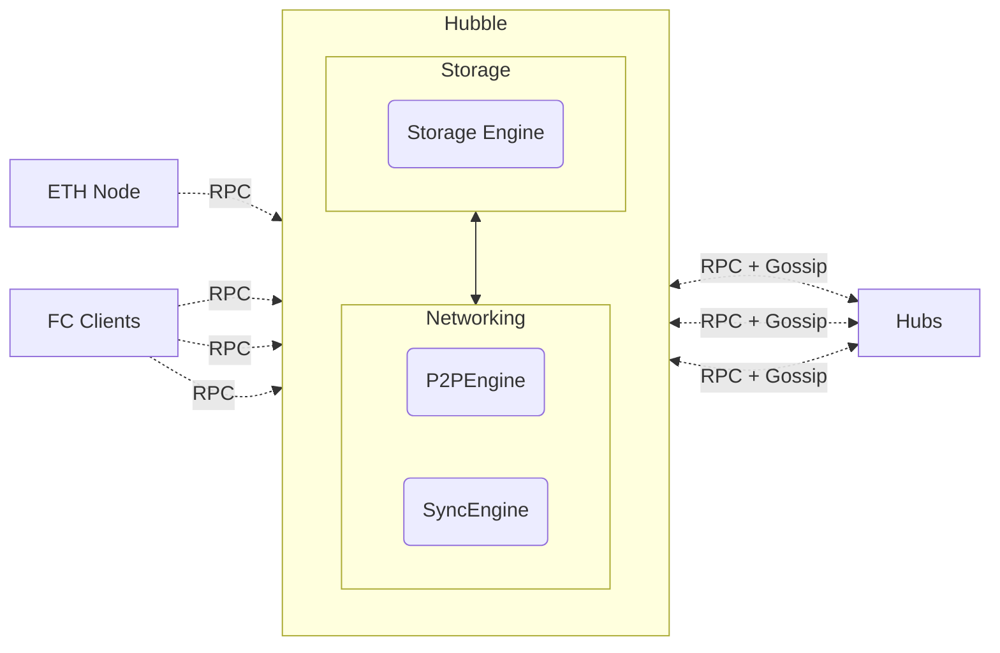
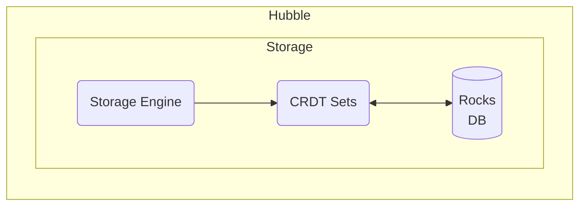
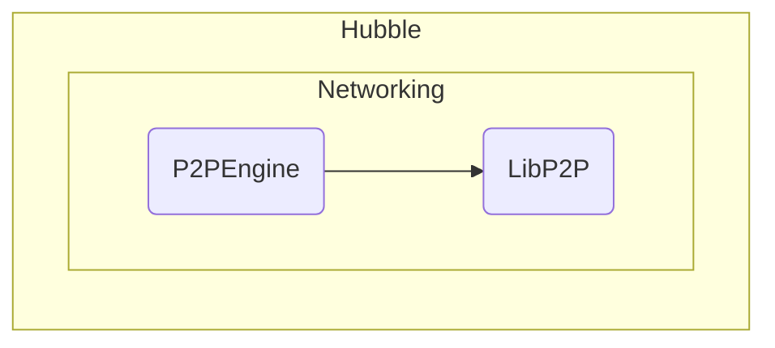
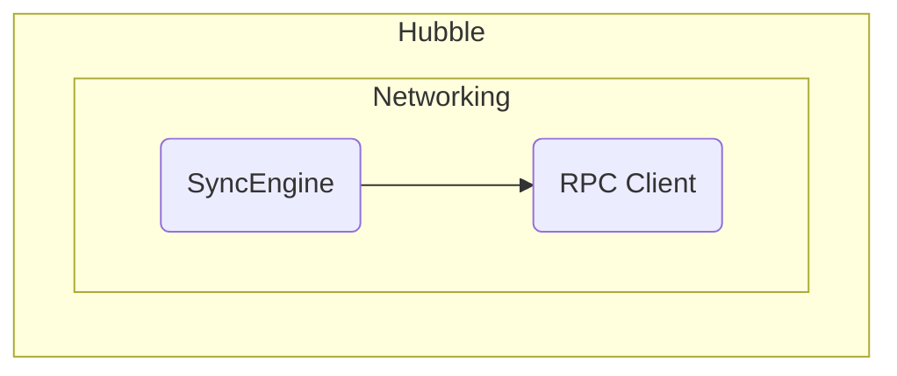

# Hubble

Hubble is a Typescript implementation of a Farcaster Hub. Hubs store messages uploaded by users and replicate them to other Hubs according to the [protocol specification](https://github.com/farcasterxyz/protocol).

## Getting Started

### Starting Hubble

You'll need to [install dependencies](../../CONTRIBUTING.md#2-setting-up-your-development-environment) and have the RPC URL of an Ethereum Goerli node, which you can get [Alchemy](https://www.alchemy.com/) or [Infura](https://www.infura.io/). Then:

1. Navigate to this folder (`/apps/hubble`) from the root
2. Run `yarn identity create` to generate an identity key pair.

#### Connecting to Devnet

Hubble can be started in devnet mode which is used for local testing. Identity state will be read from on-chain contracts but
it will not connect to peers. To connect to devnet:

1. Run `yarn start -e <eth-rpc-url> -n 3` to boot up the Hub, where `eth-rpc-url` points to the Goerli node's RPC

#### Connecting to Testnet

Hubble can be started in testnet mode where it peers with other hubs. The Farcaster team runs a set of hub that publish
messages every 10 seconds to make testing easy. To connect to testnet:

1. Run `yarn start -e <eth-rpc-url> -b /dns/testnet1.farcaster.xyz/tcp/2282 -n 2`
2. If you've previously connected to devnet or mainnet, run `yarn dbreset` to clear the database before starting

#### Connecting to Mainnet

Hubble mainnet is not yet available.

### Deploying Hubble in the cloud

Hubble can be run on cloud servers with 2 vCPUs, 8 GiB RAM and 15 GiB of SSD storage. Follow these guides to get Hubble running on your preferred provider:

- [AWS EC2](https://warpcast.notion.site/Set-up-Hubble-on-EC2-Public-23b4e81d8f604ca9bf8b68f4bb086042)
- GCP (planned)
- Azure (planned)
- [Digital Ocean](https://warpcast.notion.site/Set-up-Hubble-on-DigitalOcean-Public-e38173c487874c91828665e73eac94c1)

### Interacting with Hubble

Hubble exposes [gRPC](https://grpc.io/) API's and uses [Protobufs](https://github.com/protocolbuffers/protobuf) for data serialization. SDK's are available to interact with Hubble API's:

- [Javascript / Typescript](../../packages/hub-nodejs/)
- Golang (planned)

## Architecture

A Hub is a single-process daemon that receives data from clients, other hubs and farcaster contracts. It has three main components:

- [P2P Engine]() - establishes a gossipsub network to exchange messages with hubs.
- [Sync Engine]() - handles edge cases when gossip fails to deliver messages.
- [Storage Engine]() - checks message validity, persists them to disk and emits events.

### Storage Engine

Messages received by Hubble are forwarded to the Storage engine which forwards them to the appropriate CRDT Set. Once validated by the CRDT Set, messages are persisted to [RocksDB](https://github.com/facebook/rocksdb) and events are emitted to listeners.

CRDT sets are implemented to meet the specification in the Farcaster protocol. The engine also tracks state of the Farcaster contracts, which are necessary for validating the Signer CRDT Set.

### P2P Engine

Hubble connects to other peers over a GossipSub network established using [LibP2P](https://github.com/libp2p/libp2p). Messages merged into the Storage Engine are immediately gossiped to all of is peers.

Hubble will only peer with trusted peers and employs a simple network topology during beta. It peers only with known instances which must be configured at startup. In later releases, the network topology will be modified to operate closer to a trustless mesh.

### Sync Engine

Hubble periodically performs a [diff sync](https://github.com/farcasterxyz/protocol#41-synchronization) with other peers to discover messages that may have been dropped during gossip. This is performed using gRPC APIs exposed by each Hub instance.

