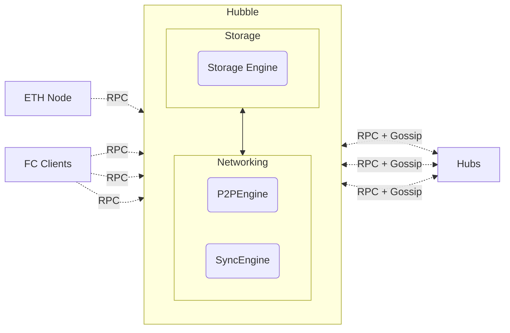
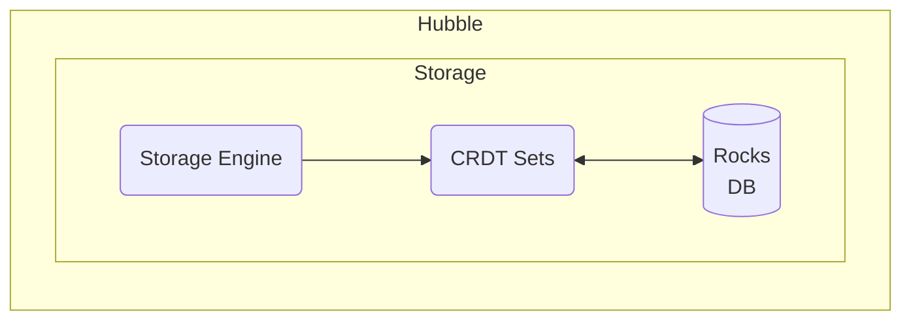
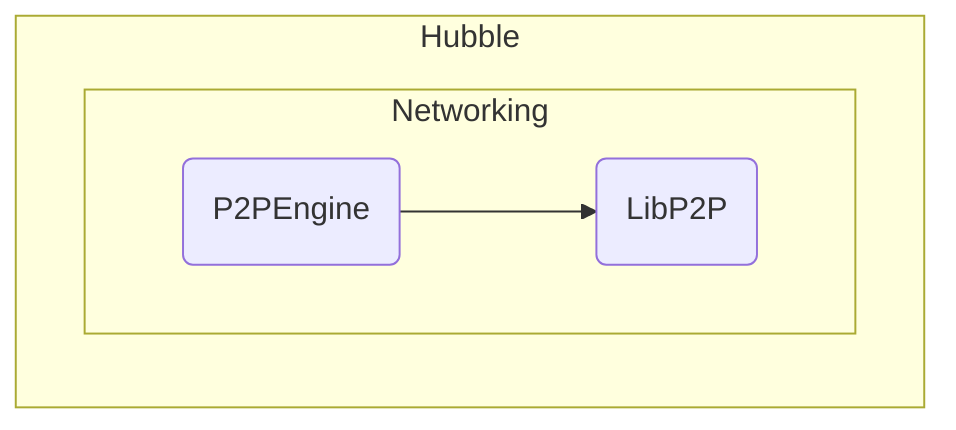
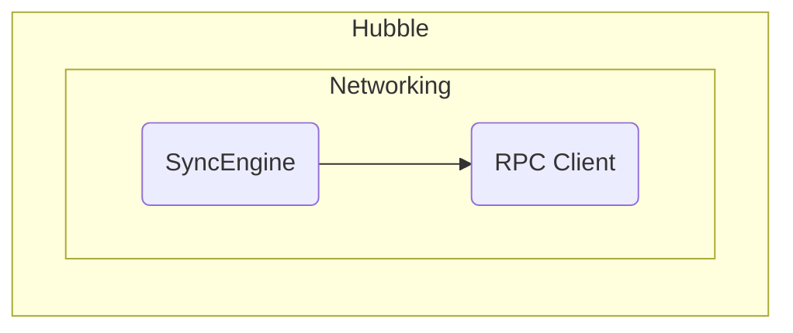

# Hubble

Hubble is an implementation of a [Farcaster Hub](https://github.com/farcasterxyz/protocol), written in [TypeScript](https://www.typescriptlang.org/).

A Hub will download an entire copy of the network to your machine and keep it in sync. Messages can be created and uploaded to a Hub and they will propagate to all other Hubs. Running a Hub gives you a private instance that you can query as much as you like and helps decentralize the network.

If you already have the URL of a publicly hosted Hub, just follow instructions on [interacting with Hubs](#hammer-interacting-with-hubble). Otherwise, follow the instructions below to start running your own hub!

## :computer: Getting Started Locally

Run a local Hubble instance on your computer to familiarize yourself with the basics.

### 1. Set up the Repository

1. Install [Docker](https://docs.docker.com/get-docker/)
2. Clone this repository: `git clone https://github.com/farcasterxyz/hub-monorepo.git`
3. Navigate to this directory: `cd apps/hubble`
4. Run `docker compose run hubble yarn identity create` to generate an identity key pair for your hub
5. Get an Ethereum Goerli node RPC URL from [Alchemy](https://www.alchemy.com/) or [Infura](https://www.infura.io/)

### 2. Connect to Testnet

Testnet is a sandboxed environment where you can read and write messages without affecting your production account. Dummy messages are broadcast every 10 seconds for testing. Minimum requirements are 4GB RAM and 5 GB of free space.

1. Create a `.env` file in your `apps/hubble` directory, substituting the relevant value for your `ETH_RPC_URL`:
   ```
   ETH_RPC_URL=your-ETH-RPC-URL
   FC_NETWORK_ID=2
   BOOTSTRAP_NODE=/dns/testnet1.farcaster.xyz/tcp/2282
   ```
2. Run `docker compose up`

### 3. Verify Your Setup

Hubble will sync with the on-chain contracts, and issue thousands of messages like this:

```jsx
0 | hubble | { level: 30, time: 1679703063660, pid: 3259, hostname: 'ip-10-0-0-85', component: 'EthEventsProvider', blockNumber: 8712752, msg: 'new block: 8712752 };

0 | hubble | { level: 30, time: 1679702496763, pid: 3259, hostname: 'ip-10-0-0-85', component: 'SyncEngine', total: 1, success: 1, msg: 'Merged messages', };
```

You can monitor the status of the sync with:
```sh
docker compose exec hubble yarn status --watch --insecure
```

### 4. Switch to Mainnet

Mainnet is Farcaster's production environment apps use and writing a message here will make it show up in all applications. Minimum requirements are 8GB RAM and 20GB of disk space.

1. Update the `.env` file in your `apps/hubble` directory, substituting the relevant value for your `ETH_RPC_URL`:
   ```
   # Note: this should still point to goerli and not eth mainnet
   ETH_RPC_URL=your-ETH-RPC-URL
   FC_NETWORK_ID=1
   BOOTSTRAP_NODE=/dns/nemes.farcaster.xyz/tcp/2282
   ```
2. Get your PeerId from the file `/apps/hubble/.hub/<PEER_ID>_id.protobuf`
3. Make a PR to add it to the [allowed peers list](https://github.com/farcasterxyz/hub-monorepo/blob/main/apps/hubble/src/allowedPeers.mainnet.ts).
4. Wait for the core team to deploy changes, usually within 24-48 hours.
5. If you were on a different network, run `docker compose stop && docker compose run --rm hubble yarn dbreset` to clear the database.
6. Run `docker compose up -d`

## :cloud: Getting Started in the Cloud

Deploy Hubble to the cloud for long-term usage.

A server with at least 2 vCPUs, 8 GiB RAM and 20 GiB of SSD storage is recommended. The instance must have a publicly accessible IP address and TCP ports 2282 and 2283 must be open.

### 1. Set up a Linux VM

Set up your Linux VM. Guides are available for some cloud providers:

- [AWS EC2](https://warpcast.notion.site/Set-up-Hubble-on-EC2-Public-23b4e81d8f604ca9bf8b68f4bb086042)
- [Digital Ocean](https://warpcast.notion.site/Set-up-Hubble-on-DigitalOcean-Public-e38173c487874c91828665e73eac94c1)

### 2. Set up the Environment

Next follow these instructions which should work on most Linux environments:

1. Install [Docker](https://docs.docker.com/desktop/install/linux-install/)
2. Clone this repository: `git clone https://github.com/farcasterxyz/hub-monorepo.git`
3. Navigate to this directory: `cd apps/hubble`
4. Create your hub identity by running `docker compose run --rm hubble yarn identity create`
5. Get an Ethereum Goerli node RPC URL from [Alchemy](https://www.alchemy.com/) or [Infura](https://www.infura.io/)

### 3. Connect to Testnet

Testnet is a sandboxed environment where you can read and write messages without affecting your production account. Dummy messages are broadcast every 10 seconds for testing. Minimum requirements are 4GB RAM and 5 GB of free space.

Create a `.env` file in your `apps/hubble` directory, substituting the relevant value for your `ETH_RPC_URL`:

```
ETH_RPC_URL=your-ETH-RPC-URL
FC_NETWORK_ID=2
BOOTSTRAP_NODE=/dns/testnet1.farcaster.xyz/tcp/2282
```

Run `docker compose up hubble`

### 4. Verify Your Setup

Hubble will sync with the on-chain contracts, and issue thousands of messages like this:

```jsx
0 | hubble | { level: 30, time: 1679703063660, pid: 3259, hostname: 'ip-10-0-0-85', component: 'EthEventsProvider', blockNumber: 8712752, msg: 'new block: 8712752 };

0 | hubble | { level: 30, time: 1679702496763, pid: 3259, hostname: 'ip-10-0-0-85', component: 'SyncEngine', total: 1, success: 1, msg: 'Merged messages', };
```

You can monitor the status of the sync with:
```sh
docker compose exec hubble yarn status --watch --insecure
```

### 5. Switch to Mainnet

Mainnet is Farcaster's production environment apps use and writing a message here will make it show up in all applications. Minimum requirements are 8GB RAM and 20GB of disk space.

1. Update the `.env` file in your `apps/hubble` directory, substituting the relevant value for your `ETH_RPC_URL`:
   ```
   # Note: this should still point to goerli and not eth mainnet
   ETH_RPC_URL=your-ETH-RPC-URL
   FC_NETWORK_ID=1
   BOOTSTRAP_NODE=/dns/nemes.farcaster.xyz/tcp/2282
   ```
2. Get your PeerId from the file `apps/hubble/.hub/<PEER_ID>_id.protobuf`
3. Make a PR to add it to the [allowed peers list](https://github.com/farcasterxyz/hub-monorepo/blob/main/apps/hubble/src/allowedPeers.mainnet.ts).
4. Wait for the core team to deploy changes, usually within 24-48 hours.
5. If you were previously on a different network (e.g. Testnet), run `docker compose stop && docker compose run --rm hubble yarn dbreset` to clear the database.
6. Run `docker compose up -d`

You can monitor the status of the sync with:
```sh
docker compose exec hubble yarn status --watch --insecure
```

## :hammer: Interacting with Hubble

Fetching data from Hubble requires communicating with its [gRPC](https://grpc.io/) API's and reading the [Protobuf](https://github.com/protocolbuffers/protobuf) messages. There are SDK's in a few languages to make this easier:

- [JavaScript / TypeScript](../../packages/hub-nodejs/)
- [Python](https://github.com/mirceapasoi/hub_py)

## :gear: Advanced Setup

### Upgrading your Hubs

1. Go to `apps/hubble` in this repo
2. Pull the latest image: `docker pull farcasterxyz/hubble:latest`
3. Run `docker compose stop && docker compose up -d --force-recreate`
4. If you are upgrading from a non-docker deployment to docker, make sure the `.hub` and `.rocks` directories are writable for all users. 

Check the logs to ensure your hub is running successfully:
```sh
docker compose logs -f hubble
```

### Authentication

Your hub is not authenticated meaning that _anyone_ can connect to it and request messages. You can add authentication by setting up SSL and adding a username and password to your hubs (instructions to follow).

### Peering

Your node will try to discover its public IP by connecting to a third party service, so that it can broadcast its contact details to peers. If you have a custom config or prefer not to use a service, specify your IP with the `--announce-ip` flag when calling yarn start.

## Architecture

A Hub is a single-process daemon that receives data from clients, other hubs and farcaster contracts. It has three main components:

- [P2P Engine]() - establishes a gossipsub network to exchange messages with hubs.
- [Sync Engine]() - handles edge cases when gossip fails to deliver messages.
- [Storage Engine]() - checks message validity, persists them to disk and emits events.



### Storage Engine

Messages received by Hubble are forwarded to the Storage engine which forwards them to the appropriate CRDT Set. Once validated by the CRDT Set, messages are persisted to [RocksDB](https://github.com/facebook/rocksdb) and events are emitted to listeners.



CRDT sets are implemented to meet the specification in the Farcaster protocol. The engine also tracks state of the Farcaster contracts, which are necessary for validating the Signer CRDT Set.

### P2P Engine

Hubble connects to other peers over a GossipSub network established using [LibP2P](https://github.com/libp2p/libp2p). Messages merged into the Storage Engine are immediately gossiped to all of is peers.



Hubble will only peer with trusted peers and employs a simple network topology during beta. It peers only with known instances which must be configured at startup. In later releases, the network topology will be modified to operate closer to a trustless mesh.

### Sync Engine

Hubble periodically performs a [diff sync](https://github.com/farcasterxyz/protocol#41-synchronization) with other peers to discover messages that may have been dropped during gossip. This is performed using gRPC APIs exposed by each Hub instance.


