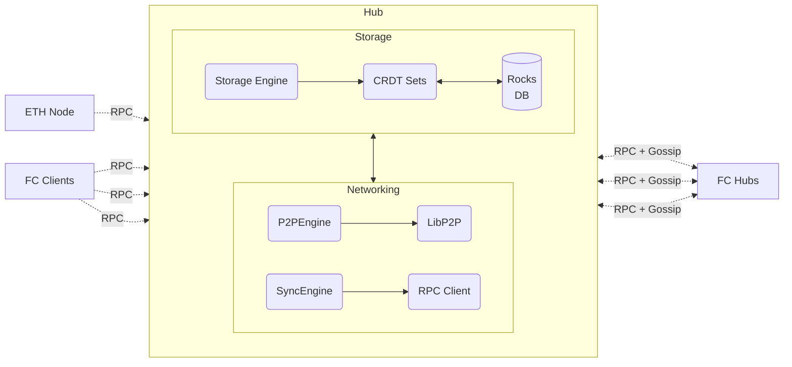
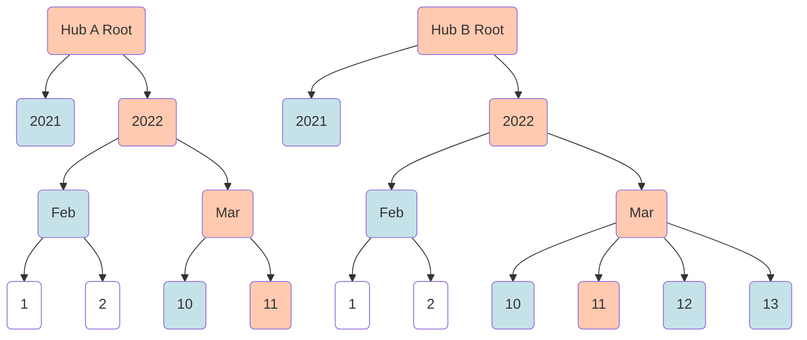

# Farcaster Hub

A Hub is a server that stores and replicates Farcaster Messages.

Users generate messages and upload them to Hub, which propagates them to other Hubs on the network. Hubs come together to form a causally consistent peer-to-peer network for storing data generated by Farcaster users. Read the [protocol docs](https://github.com/farcasterxyz/protocol) for a high-level overview of how Farcaster works.

## Getting Started

After [setting up your environment](../CONTRIBUTING.md#2-setting-up-your-development-environment) navigate to this folder from the root and run the following steps:

Then, run:

- `yarn identity create` to create a network identity for your Hub
- `yarn start -e <eth-rpc-url>` to boot up the Hub, where `eth-rpc-url` points to the Goerli node's RPC

If you don't have a Goerli node's HTTP RPC URL, you can get one using [Alchemy](https://www.alchemy.com/) or [Infura](https://www.infura.io/).

## Architecture

A Hub is a single-process daemon that receives data from clients, other hubs and farcaster contracts. It has three main components:

- [Storage Engine]() - accepts valid messages, merges them into a consistent state, and persists state to disk.
- [P2P Engine]() - gossips with other hubs to send and receive the latest messages on the network.
- [Sync Engine]() - brings two hubs into sync when gossip messages between them fail to deliver.

### Storage Engine

The Storage Engine validates the signature and schema of every received message. It computes the set of valid signers for a user by tracking Farcaster contract events and uses this to verify each message.

Verified messages are merged into a Set, a data structure that represents the current state of the user's data on the network. A Set uses CRDT's to ensure that merging a message is commutative, associative and idempotent. This means that two Hubs that receive a set of messages in any order will always end up in the same state.

A successful state change triggers an event that is sent to the sync and p2p engines. The new state is persisted to disk via [RocksDB](https://github.com/facebook/rocksdb) so that the Hub can restore state if it goes down. The state can also be restored from an external store which makes starting new Hubs faster.

### Sync Engine

The Sync Engine uses a [Merkle Patricia Trie](https://ethereum.org/en/developers/docs/data-structures-and-encoding/patricia-merkle-trie/) to track the set of known messages. When two Hubs communicate, the Sync Engine compares both tries to download new messages.

When the Storage Engine persists a message, a `timestamp hash` key is generated by combining the message's timestamp and hash. Such keys are unique and result in a trie that is chronologically ordered from left to right. Since messages arrive roughly chronologically, most insertions happen on the right-hand side of the tree, which makes diffing trees much faster.

The diff between two tries is computed by determining the most chronologically recent branch on one Trie. For Hub A this would be `2022 -> Mar -> 11` as highlighted in orange in the diagram below. The exclusion set is calculated which is the set of hashes for the highest nodes outside the recent branch. For Hub A this would be `[hash(2021), hash(Feb), hash(10)]` highlighted in blue in the diagram below.

Hub A's Sync Engine sends the recent branch to B and asks for its exclusion set. Since Hub B has more recent messages, the exclusion set would be a`[hash(2021), hash(Feb), hash(10 + 12 + 13)]`. By comparing exclusion sets the Sync Engine can determine that state diverges only in March 2022. A more traditional diffing algorithm can be used to walk the March trie to find the missing keys and request them from Hub B.

### P2P Engine

The P2P Engine is responsible for gossiping messages to and from other Hubs on the Farcaster network. It uses [LibP2P](https://github.com/libp2p/libp2p) for the networking stack and is bootstrapped with a list of trusted peers.

A Gossip message contains the most recent message discovered by the Hub along with the Hub's state expressed as the root of the merkle trie. The recipient can update its own state with the message and check if the merkle trie's match. If they do not, the Hubs have a different set of messages and will call their sync engines to execute a full sync.

### Run-Loop

When a Hub boots up for the first time, it goes through the following steps:

- Download and load a trusted snapshot of network state into the database (if available)
- Peer with other Hubs and start listening for Gossip Messages
- Start an RPC Client to get messages from Farcaster client applications.
- Connect to an ETH node and get events from [Farcaster contracts](https://github.com/farcasterxyz/contracts).

If a client sends a hub a new message over RPC:

- The Storage Engine writes the message to the database and fires an event.
- The Sync Engine adds the message id into its merkle trie and recalculates the root.
- The P2P Engine gossips the new message and the merkle trie root to its peers.

If a Hub receives gossip via P2P:

- The Storage Engine stores the message from the gossip, if it is new.
- The Sync engine updates its merkle trie root, and then compares it against the gossip's merkle trie root.
- If the roots do not match, the other Hub may have new messages
- The Sync engine fetches new messages and sends them to the Storage engine to be persisted

If an ETH node sends a new contract event via RPC:

- The Storage engine receives the message and updates internal state accordingly

## TroubleShooting

### Upgrading Libp2p

1. Pick a [libp2p release](https://github.com/libp2p/js-libp2p/releases) and navigate to its [package.json](https://github.com/libp2p/js-libp2p/blob/master/package.json) file
2. Copy the required versions of `libp2p`, `@libp2p/*`, `@chainsafe/*` `@multiformats/*` packages to our package.json
3. For unspecified packages read their changelog and make a best guess about versions (e.g. `@chainsafe/libp2p-gossipsub` and `@libp2p/pubsub-peer-discovery`)
4. Follow the [migration guide](https://github.com/libp2p/js-libp2p/tree/master/doc/migrations) for the versions you are upgrading to

If you run into any unexpected issues open a discussion in the [libp2p forum](https://discuss.libp2p.io/). @achingbrain on the Filecoin slack maintains this project and can be helpful with major issues.
