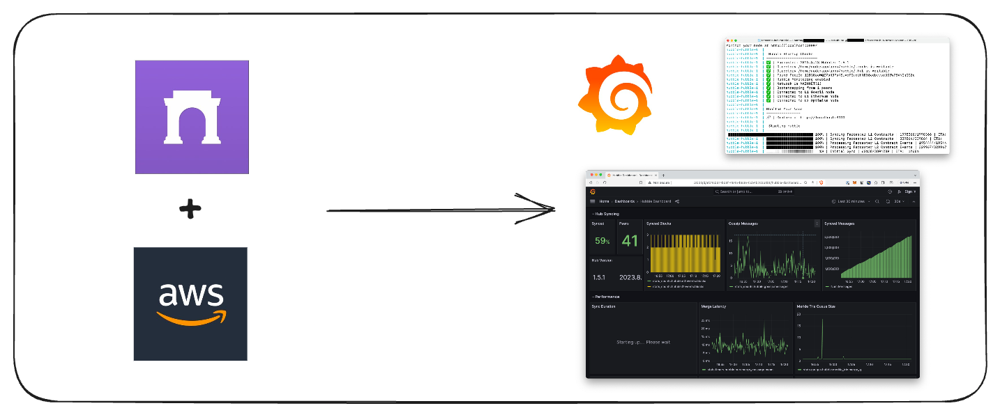
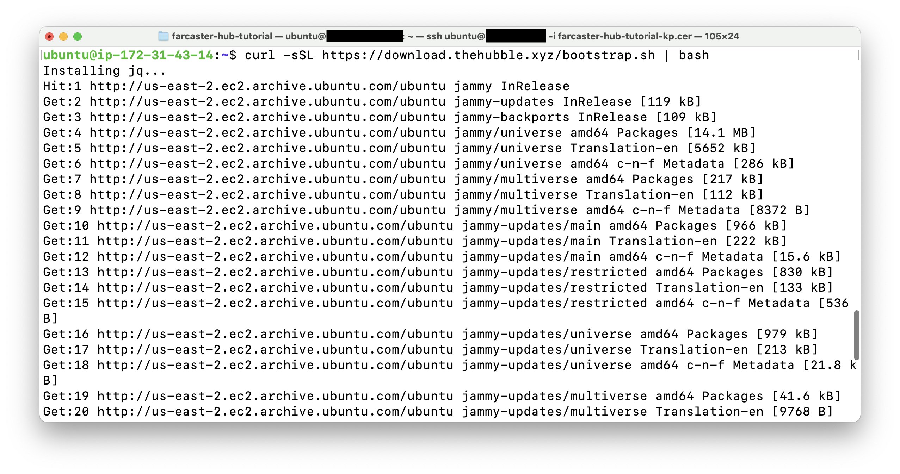
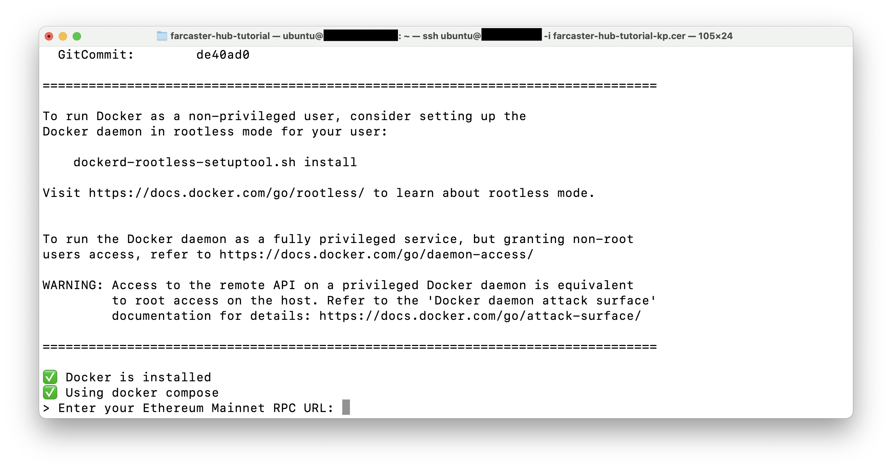
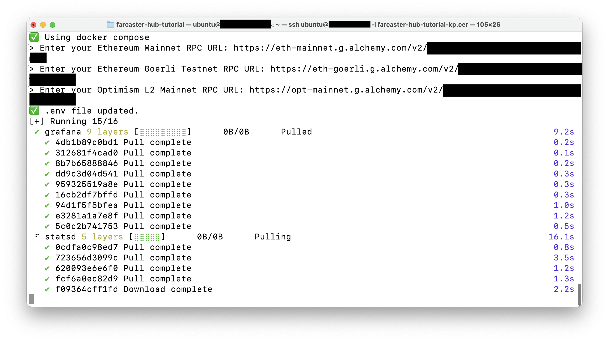
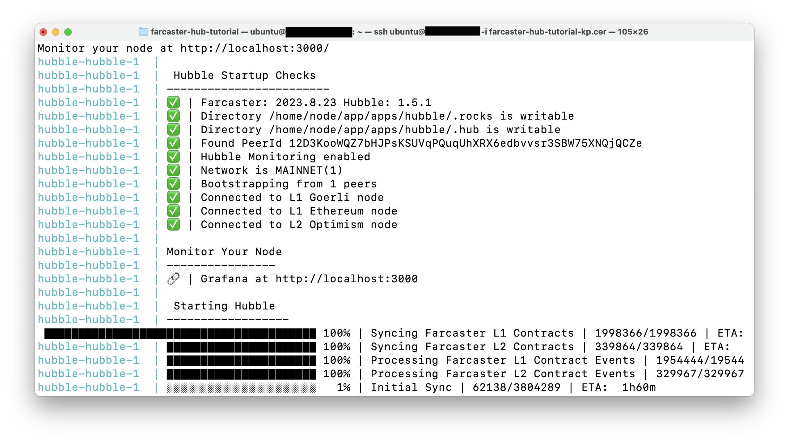
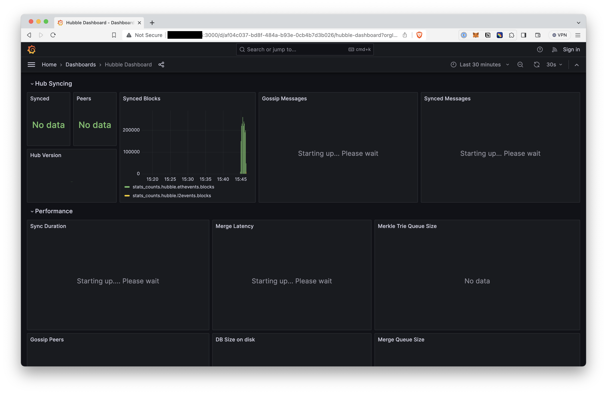
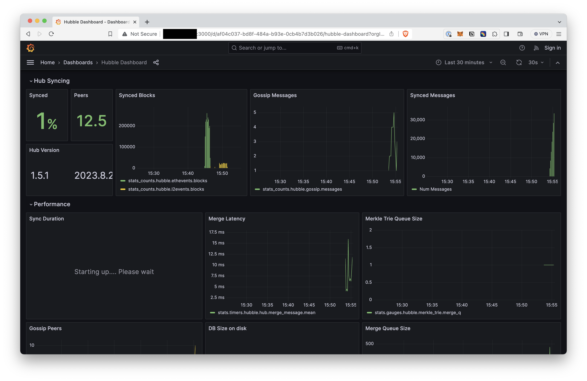

# Run a Farcaster hub on AWS

## Get an AWS EC2 instance
### Launch EC2 instance

### Configure network permissions

### Connect to your instance
TODO

## Install hubble

### Get alchemy keys

### Run install script

## Run hubble

## Monitoring

## Upgrading hubble

## Troubleshooting

