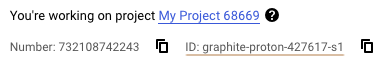
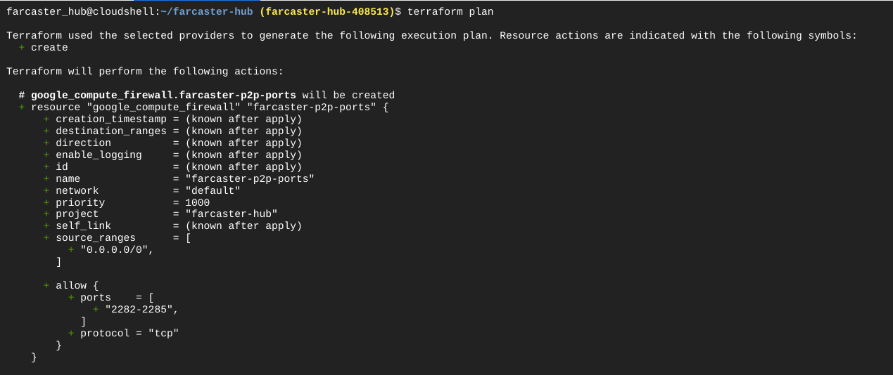
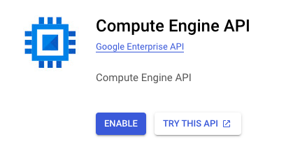
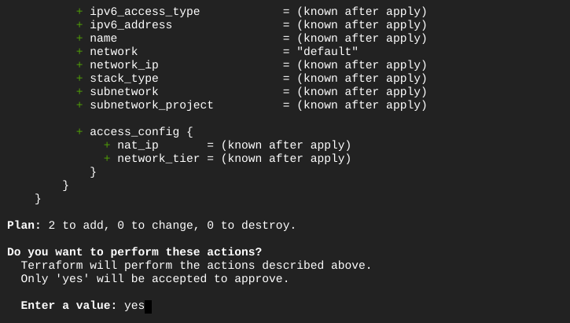
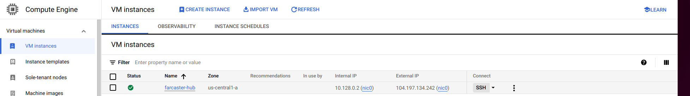
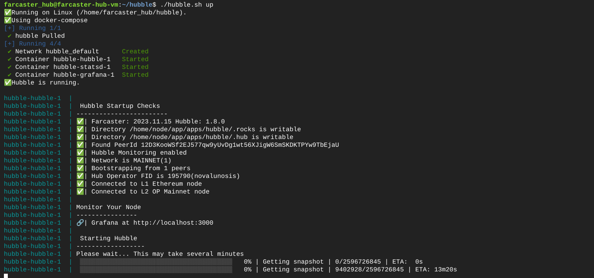

# Run a Hubble on GCP

## Intro
This is a step-by-step guide to setting up Hubble on GCP. 
It usually takes less than 30 minutes to complete the whole process.

### Requirements
- [GCP](https://console.cloud.google.com/) account
- [Alchemy](https://www.alchemy.com/) account

### Costs
- GCP setup recommended in this tutorial may cost up to $70/month
- Alchemy usage should stay within the free tier


## Create GCP VM

Open **Google Cloud Shell** and execute the following commands:

<figure><figcaption><p>Click on Google Cloud Shell Icon</p></figcaption></figure>

Execute the below commands in the cloud shell:

<pre><code><strong>mkdir farcaster-hub
</strong>cd farcaster-hub
nano main.tf
</code></pre>

Now paste the content of below into your main.tf \ 
Replace "$YOUR_PROJECT_ID" with your personal ID.

<figure></figure>

This is the configuration of your GCP virtual machine that will be created.

```
provider "google" {
  project = "$YOUR_PROJECT_ID"
  region  = "us-central1"
}

resource "google_compute_instance" "farcaster-hub-vm" {
  name         = "farcaster-hub-vm"
  machine_type = "e2-standard-4"  # 4 vCPUs, 16 GB memory
  zone         = "us-central1-a"  # Specify the zone here


  boot_disk {
    initialize_params {
      image = "ubuntu-2004-focal-v20231213"  # Ubuntu 20.04 LTS image URL
      size = 160  # 160 GB disk size
    }
  }

  network_interface {
    network = "default"
    access_config {
      // This will assign a public IP address to the instance
    }
  }

  tags = ["allow-farcaster-p2p-ports"]  # For firewall rule

  metadata = {
    # You can add any additional metadata here if needed
  }
}

resource "google_compute_firewall" "farcaster-p2p-ports" {
  name    = "farcaster-p2p-ports"
  network = "default"
  
  # allow incoming traffic for ports 2282-2285
  allow {
    protocol = "tcp"
    ports    = ["2282-2285"]
  }

  source_ranges = ["0.0.0.0/0"]
}
```

Execute this command:

```
terraform init # to initialize terraform in your farcaster-hub folder
```

Execute this command:

```
terraform plan # this will simulate your terraform configuration & check if it is correct
```

Example output:

<figure><figcaption><p>Example output of terraform plan</p></figcaption></figure>

Enable Compute Engine API

<figure></figure>

Now execute this command:

```bash
terraform apply
```

<figure><figcaption><p>Example output of Terraform apply</p></figcaption></figure>

It will take a few minutes before the VM is created. Time to enjoy your :coffee:

<figure><figcaption></figcaption></figure>

Now you should be able to connect to your VM by clicking on the **SSH** button.

\
Now Install Docker as described here [https://docs.docker.com/engine/install/ubuntu/](https://docs.docker.com/engine/install/ubuntu/)


Now follow the steps as described on [Install page](../intro/install.md) \
\
Your Hubble is up and running when you see below :white\_check\_mark:

<figure><figcaption></figcaption></figure>
